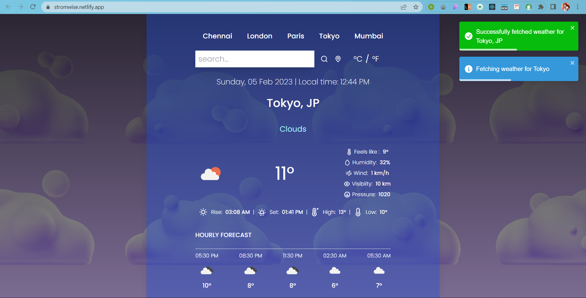
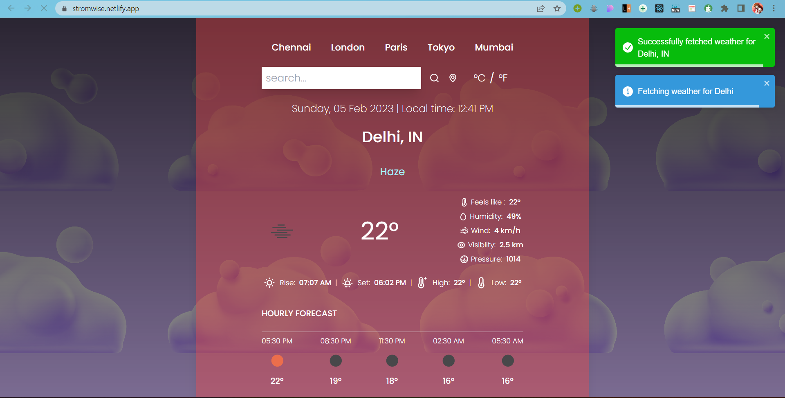

 
# StromWise 
#### Real time weather app.

Get the accurate weather data around you or of any city present in the globe.

It is a real time weather application built using ReactJs and OpenWeatherAPI which displays current weather, hourly forecasts and other details based on user geolocation or city search.
It also supports dynamic background change depending on weather condition.  

## Screenshot  

## Tech Stack  

HTML, CSS, JavaScript, React

Tailwind CSS, Luxon, React-Toastify, Unicons

OpenWeatherMap-API 

## Features  

- Easy to use user Interface.
- Real time weather data of any place all over the world.   
- User Geolocation feature. 
- Option to display data in °C or °F.
- Date and Local time display. 

Get the detailed forecast like:
- Current and Feels-like temperature
- Wind speed and humidity
- Pressure and visibilty information
- Sunrise/sunset time
- Max/Min temp
- Hourly Forecast

#### Note:
Daily forecast feature is no longer available as OneCall Api is not free anymore

## Run Locally  

Install dependencies  

~~~bash  
npm install
~~~

Start the server  

~~~bash  
npm run start
~~~

#### Prerequisites:
You will need your API Key to run this application locally.
## Author  

[ananya](https://github.com/104ananya)

## Acknowledgements  

[yashpatel](https://github.com/)

